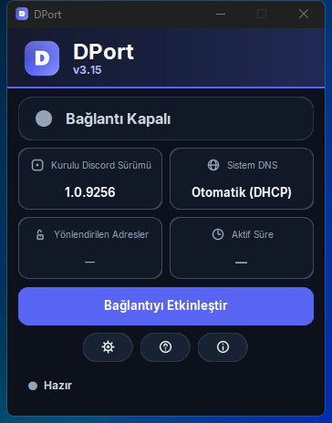

<div align="center">

# ⚡ DPort

**Discord'un açılmadığı ya da güncellenmediği durumlarda, başka bir program kurmadan bağlanmanı sağlayan küçük bir Windows aracı.**


### ⬇️ [**Son yayımlanan DPort sürümünü indir**](https://github.com/IzzmooPro/DPort/releases/latest)

<sub>v3.16 test hazırlığında; henüz yayımlanmadı. Planlanan dosya: `DPort-Setup-3.16.exe`. İndirme bağlantısı son yayımlanan sürüme gider.</sub>

</div>

---

## Arayüz

v3.15 uygulamasından gerçek ekran görüntüsü (v3.16 için yeni görsel henüz alınmadı):

<p align="center">
  
</p>

Bağlantı etkinleştiğinde aynı düğme **Varsayılana Dön** olur. Discord'u kendi kısayolunuzdan açabilirsiniz.

---

## DPort ne yapar?

Bazı ağlarda Discord açılmaz, takılır veya güncellemesini bitiremez. DPort, Discord'un bağlanmak için kullandığı yolu düzelterek bu sorunu aşmayı dener.

Tek bir durum düğmesi vardır: bağlantı kapalıyken **Bağlantıyı Etkinleştir**, açıkken **Varsayılana Dön** yazar. DPort yalnızca bağlantı yolunu hazırlar; Discord'u kullanıcı kendi kısayolundan, istediği zaman açar.

---

## Üç adımda kullan

**1. İndir ve kur**
[Son sürümü indir](https://github.com/IzzmooPro/DPort/releases/latest) ve ilgili `DPort-Setup` dosyasını çalıştır. Windows yönetici onayı isteyecek.

**2. DPort'u aç**
Masaüstü kısayolundan başlat. Tek pencerelik, sade bir arayüz açılır.

**3. "Bağlantıyı Etkinleştir" düğmesine bas**
DPort gerekli bağlantı ayarlarını yapar. Ardından Discord'u masaüstü/başlat menüsü kısayolundan ne zaman istersen kendin aç. DPort, Discord'u başlatmaz, kapatmaz veya yeniden başlatmaz. İşin bitince aynı düğmedeki **Varsayılana Dön** eylemine basabilirsin.

> Discord'u kullanırken DPort'un açık kalması gerekir — bağlantı onun üzerinden gittiği için kapatırsan Discord'un bağlantısı kesilebilir. Pencereyi kapatınca tepside açık bırakabilirsin.

---

## Bilgisayarında neyi değiştirir?

DPort üç şeye dokunur. Üçü de **Varsayılana Dön** ile veya program kapanınca geri alınır:

| Ne | Ne için | Geri alınır mı? |
|---|---|---|
| **DNS ayarı** | Ağ adaptörünün DNS'ini Cloudflare'e (`1.1.1.1`) çevirir, böylece Discord adresleri doğru çözülür | Evet — orijinal ayarın yedeklenir ve aynen geri yüklenir |
| **`hosts` dosyası** | Yalnızca 5 Discord adresini kendi bilgisayarına yönlendirir | Evet — yalnızca kendi eklediği işaretli satırları siler, diğer satırlarına dokunmaz |
| **Yerel röle** | Bilgisayarında küçük bir aktarıcı çalıştırır ve Discord trafiğini oradan geçirir | Evet — program kapanınca durur |

Yönlendirilen adresler: `discord.com`, `updates.discord.com`, `gateway.discord.gg`, `cdn.discordapp.com`, `media.discordapp.net`.

DPort beklenmedik şekilde kapanırsa (çökme, görev yöneticisinden kapatma), `hosts` değişikliğini bir sonraki açılışta veya oturum açışında otomatik temizlemeye çalışır.

---

## Neden yönetici izni istiyor?

Dürüst cevap: **yapmak istediği şeyler yönetici hakkı olmadan yapılamaz.**

- Ağ adaptörünün **DNS ayarını değiştirmek** yönetici gerektirir.
- Windows'un **`hosts` dosyası** korumalı bir sistem dosyasıdır; yazmak için yönetici gerekir.
- **Kurtarma ve güncelleme dosyalarının tutulduğu korumalı konumları** yönetmek (oluşturmak ve izinlerini sıkı tutmak) yönetici gerektirir.
- Çökme sonrası temizlik yapan **yüksek yetkili zamanlanmış görevi** güvenli biçimde kurmak yönetici gerektirir.

Bunlar programın tamamının yaptığı iştir; başka bir amaçla yükseltilmiş yetki kullanılmaz. Ne yaptığını kendi gözünle görmek istersen kaynak kodu bu depoda.

---

## ⚠️ Windows "Bilinmeyen yayıncı" diyebilir

**DPort'un dijital imzası (kod imzalama sertifikası) yoktur.** Bu yüzden kurulumda Windows SmartScreen uyarısı çıkabilir ve UAC penceresinde yayıncı adı **"Bilinmeyen"** görünebilir.

Bu uyarı, DPort'un şu anda kod imzalama sertifikasıyla imzalanmamış olmasından kaynaklanır. Programın bozuk veya zararlı olduğu anlamına gelmez, ama **imza olmadığı için Windows dosyanın kaynağını senin adına doğrulayamaz.** Bu yüzden:

- Dosyayı **yalnızca** [resmî Releases sayfasından](https://github.com/IzzmooPro/DPort/releases/latest) indir.
- Başka sitelerden indirilen "DPort" dosyalarına güvenme.

---

## Gizlilik

Aşağıdakiler bu depodaki kaynak kodda doğrulanabilir:

- **Telemetri, analiz veya kullanım takibi yok.** Kaynak kodunda telemetri, analiz, kullanıcı kimliği toplama veya bunları yükleyen bir mekanizma bulunmuyor. İşlevsel ağ bağlantıları aşağıdaki tabloda açıkça listelenmiştir.
- **Parolanı, mesajlarını veya Discord hesabını okumaz.** DPort TLS bağlantısını sonlandırmaz, sertifika üretmez ve şifrelenmiş içeriği çözmez; mevcut TLS bağlantısını yalnızca TCP düzeyinde aktarır.
- **Kayıt tutar ama yalnızca senin bilgisayarında.** Log dosyası hangi işlemin yapıldığını yazar (ör. "DNS ayarlandı"); hiçbir yere yüklenmez ve arayüzden temizleyebilirsin.

DPort'un internete çıktığı yerler bunlarla sınırlıdır:

| Adres | Ne için |
|---|---|
| `https://1.1.1.1/dns-query`, `https://cloudflare-dns.com/dns-query`, `https://dns.google/resolve` | Discord adreslerinin IP'sini güvenli biçimde çözmek; ilk yol çalışmazsa sıradaki yedek sağlayıcıyı denemek |
| `api.github.com`, `github.com` | Yeni sürüm var mı kontrolü ve (sen onaylarsan) indirme |
| Discord adresleri | Yukarıdaki tabloda listelenen bağlantıların aktarılması |

---

## DPort bir VPN değildir

Bunu net söylemek gerekir:

- **IP adresini gizlemez.** Bağlandığın sunucular gerçek IP'ni görmeye devam eder.
- **Anonimlik sağlamaz.** İnternet servis sağlayıcın bir Discord bağlantısı kurduğunu görebilir.
- **Diğer programların trafiğini etkilemez.** Yalnızca yukarıda listelenen Discord adreslerini kapsar.
- **Her ağda çalışacağının garantisi yoktur.** Yöntem bazı ağlarda sonuç vermeyebilir.

Amacı gizlenmek değil, Discord'un bağlantısını çalışır hale getirmektir.

---

## Güncellemeler

DPort açılınca GitHub'daki son sürümü kontrol eder. Yeni sürüm varsa **sana sorar** — onayın olmadan indirmez veya kurmaz.

İndirilen kurulum dosyasının **SHA-256 özeti**, GitHub'ın o dosya için yayınladığı değerle karşılaştırılır. Uyuşmazsa dosya **çalıştırılmaz**. Doğrulama ile çalıştırma arasında dosyanın değiştirilememesi için dosya kilitli tutulur.

---

## v3.16'da ne değişti? (test hazırlığı)

- Bağlantı pasifken açık kalan DPort'un doğrulanmış kurulu süreci, kurulum sırasında Restart Manager'ın 30 saniyelik beklemesine girmeden kapatılır ve kuruluma devam edilir.
- Bağlantı aktifse güncelleme iptal edilir; kullanıcıdan önce **Varsayılana Dön** işlemini tamamlaması istenir. Kontrol, indirme öncesinde ve installer başlatılmadan hemen önce tekrarlanır.
- Elle çalıştırılan installer da korumalı DNS yedeği veya DPort hosts yönlendirmesi algılarsa zorla kapatma yapmaz. Kurulumdan sonra DPort otomatik yeniden başlatılmaz.
- ISS/DPI sorunlarını ayırt etmek için DoH ve Discord TLS denemeleri; hedef, yöntem, sonuç ve süre bilgileriyle `dport.log` dosyasına kaydedilir. Mesaj içeriği, Discord hesabı, TLS verisi veya kullanıcı IP'si kaydedilmez.

## Önceki sürüm: v3.15

- Korumalı DNS yedeği diske yazılıp doğrulanamazsa bağlantı etkinleştirilmez.
- Yeni yedek hazır olmadan eski kurtarma dosyası değiştirilmez; geçerli eski yedek biçimleri desteklenir.
- Kaynaktan çalıştırma komutu ve sabit sürümlü bağımlılık kurulumu uyumlu hale getirildi.

## Önceki sürüm: v3.14

- **DNS yedekleme dil bağımsız hale getirildi.** DNS durumu güvenle okunamazsa ağ ayarları değiştirilmez.
- **Tüm DNS adresleri sıralarıyla saklanır.** IPv4 ve IPv6 geri yüklemesi tekrar okunarak doğrulanır; hata veya eksik doğrulama varsa yedek korunur.
- **IPv6 kapalı olan adaptörler için okuma düzeltildi.** Kaydedilmiş DNS ayarı ile o anda etkin olan adres listesi birbirine karıştırılmaz.
- **Açılış güncelleme kontrolü güçlendirildi.** Geçici hatalarda 5 ve 15 saniye sonra tekrar denenir; toplam en fazla üç deneme yapılır ve sonuçlar loglanır.
- **Güncelleme kontrollerinin çakışması önlendi.** Elle kontrol devam eden isteğe katılır; bekleyen tekrarlar program kapanınca iptal edilir.

Geçerli eski DNS yedekleri desteklenir. Eski sürümün hiç kaydetmediği adresler sonradan geri oluşturulamaz; eksik veya bozuk yedekler DHCP varsayılarak uygulanmaz.

## Önceki sürüm: v3.13

Bu sürüm, DPort ile Discord'un açılışını birbirinden ayırıyor ve geri alma güvenliğini güçlendiriyor:

- **DPort artık Discord'u otomatik açmıyor, kapatmıyor veya yeniden başlatmıyor.** Önce bağlantıyı etkinleştir, ardından Discord'u istediğin zaman kendi kısayolundan aç.
- **Bağlantı yönetimi tek düğmede toplandı.** Kapalıyken “Bağlantıyı Etkinleştir”, açıkken “Varsayılana Dön” eylemi gösteriliyor.
- **İlk açılış bilgilendirmesi eklendi.** Antivirüs engeli ve yeni elle Discord açma davranışı kısa biçimde anlatılıyor; istersen bir daha gösterilmiyor.
- **Geri alma güvenliği güçlendirildi.** `hosts` temizliği ve kurtarma görevi birlikte doğrulanıyor; yarım kalan işlemler başarı gibi gösterilmiyor.
- **Hata ve durum metinleri iyileştirildi.** Uzun mesajlar pencereye sığıyor ve bağlantının gerçek durumu butona doğru yansıyor.

---

<details>
<summary><b>🔧 Teknik ayrıntılar</b></summary>

<br>

**Yöntem.** Engelleme genellikle TLS `ClientHello` paketindeki sunucu adı (SNI) görülerek yapılır. DPort, `hosts` üzerinden ilgili adresleri `127.0.0.1`'e yönlendirir; kendi rölesi bağlantıyı alır, gerçek IP'yi sertifika doğrulamalı HTTPS DoH ile çözer (Cloudflare yolları çalışmazsa Google yedeğini dener) ve `ClientHello`'yu TLS kayıt katmanında küçük parçalara bölerek gönderir. Sonrası şeffaf bir TCP tünelidir; TLS oturumu istemci ile Discord sunucusu arasında kurulur ve röle tarafından açılmaz.

**Röle sınırları.** Röle yalnızca `127.0.0.1:443` üzerinde dinler ve yalnızca yukarıda listelenen Discord adreslerine tünel açar (allowlist). SNI okunamazsa güvenli varsayılana düşer, listede olmayan hedef reddedilir.

**Geri alma yolları.** Program kapanışı, tepsiden çıkış, çalışan bir watchdog, açılıştaki kendi kendini onarma ve oturum açılışında çalışan bir zamanlanmış görev — beşi birlikte `hosts` kalıntısını temizlemeye çalışır. DNS için orijinal ayar (statik ya da otomatik) yedeklenir ve aynen geri yüklenir; DPort'un dokunmadığı adaptörlere karışılmaz.

**Kaldırma.** Kaldırıcı `hosts` bloğunu siler ve zamanlanmış görevi kaldırır. Kullanıcı ayarların (`%APPDATA%\DPort`) silinmez.

**Diğer DPI/bypass araçları.** WARP, Zapret, GoodbyeDPI gibi araçlar aynı anda çalışıyorsa çakışma olabilir. Sorun yaşarsan birini kapatıp dene.

</details>

<details>
<summary><b>💻 Kaynaktan çalıştırmak</b></summary>

<br>

```bash
git clone https://github.com/IzzmooPro/DPort.git
cd DPort
python -m pip install -r requirements.txt
python app/main.py --source-dev
```

Gereksinimler: Windows 10/11 ve Python 3.10+. Program yönetici onayı ister.

Windows'ta aynı geliştirme akışını `scripts\Calistir.bat` ile başlatabilirsin. `--source-dev` kurulu EXE gerektirmez; oturum açılışındaki hosts kurtarma görevi kurulmaz, sert kapanıştan sonra DPort'u yeniden açman gerekir. Kalıcı DNS yedeği zorunluluğu bu modda da geçerlidir.

Testler:

```bash
python -m unittest discover -s tests
```

</details>

<details>
<summary><b>🇬🇧 English summary</b></summary>

<br>

**DPort** is a small Windows tool that prepares Discord's connection path on networks where it otherwise fails. Its single action button shows **Enable Connection** while off and **Restore Defaults** while active. Then open Discord yourself whenever you want; DPort never launches, closes, or restarts Discord.

**Version 3.16 is being tested and is not published yet.** Planned installer: `DPort-Setup-3.16.exe`. Download the [latest published release](https://github.com/IzzmooPro/DPort/releases/latest).

**What it changes:** your adapter's DNS (to Cloudflare `1.1.1.1`), five Discord entries in the Windows `hosts` file, and a small local relay on `127.0.0.1:443`. All three are reverted by *Restore Defaults* or when the app closes.

**Why administrator rights:** changing the adapter's DNS, writing to the protected `hosts` file, managing the protected recovery/update locations, and safely registering the high-privilege cleanup scheduled task all require them. That is the whole job of the program.

**Not digitally signed.** Windows SmartScreen may warn you and show "Unknown publisher". Only download from the official Releases page above.

**Privacy** (verifiable in this source code): the source contains no telemetry, analytics, user-identifier collection, or any mechanism that uploads such data — the functional network connections are listed explicitly in the Turkish *Gizlilik* section above. DPort does not terminate TLS, generate certificates, or decrypt the encrypted payload; it forwards the existing TLS connection at the TCP level. Logs stay on your machine.

**Not a VPN.** It does not hide your IP, does not provide anonymity, and does not cover other applications' traffic.

**Updates** are checked against GitHub, always ask before installing, and the downloaded installer is verified with SHA-256 before it is allowed to run.

</details>

---

## ⚖️ Sorumluluk reddi

DPort kişisel kullanım için yazılmış bir araçtır ve **olduğu gibi** sunulur. Kullanım sorumluluğu kullanıcıya aittir. Sistem ayarlarını (DNS ve `hosts`) değiştirdiği için ne yaptığını okuyarak kullanmanı öneririm. Bulunduğun ülkenin ve ağının kurallarına uymak senin sorumluluğundadır.

Kaynak kodu bu depoda incelenebilir.

## 👤 Geliştirici

**IzzmooPro** — sorun bildirimi ve öneriler için [Issues](https://github.com/IzzmooPro/DPort/issues) sayfasını kullanabilirsin.
